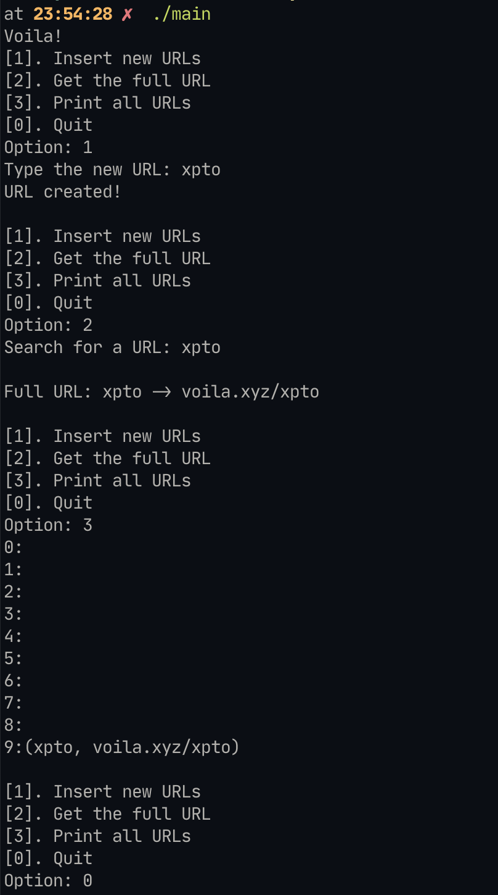

# Voilà

Este é o diretório que contém os arquivos para o exercício dirigido 5, que é
implementar um serviço de URL em hashmap em C.

```
Bit.ly é conhecido principalmente por ser um encurtador de links de URL bastante popular.
Ele funciona como uma tabela hash, em que uma string curta enigmática é construída a partir de um endereço URL longo.
Por exemplo, a string ABC em http://bit.ly/ABC representa a chave, e a URL longa correspondente é o valor associado à esta chave.

Você e seus amigos decidem fundar a empresa Voilà para fornecer um serviço de encurtamento de links de URL para concorrer com o Bit.ly.
Decidem também utilizar tabela hash para o armazenamento e recuperação dos nomes curtos (chaves) e nomes longos (valor).
```

## Execução

